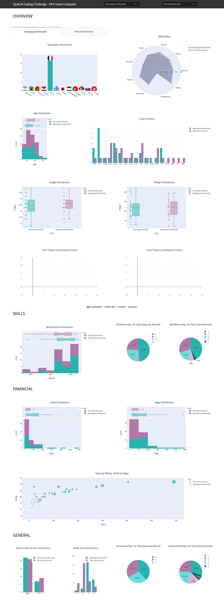

# Quilt.AI Coding Challenge - FIFA Team Comparer

Coding Challenge by Maxence GS for Quilt.AI where I am using [Dash](https://plot.ly/dash/) from Plotly to create my web application in python.

## Direct Link

The Dashboard is hosted on a private Debian instance.
You can view it online [here](http://51.158.113.67:8050).
(Please check your firewall or Ad-Blocker)


## Installation

Installation steps can be found [here](https://dash.plot.ly/installation) but it is as simple as :

```bash
pip install dash==1.8.0
```

Additional library are needed for my app :
```
+ pandas
+ numpy
+ pillow
```

## Usage

Running the dashboard.py file will automatically  run the application on `127.0.0.1:8050`.

```bash
$ python dashboard.py
```

## Preview

